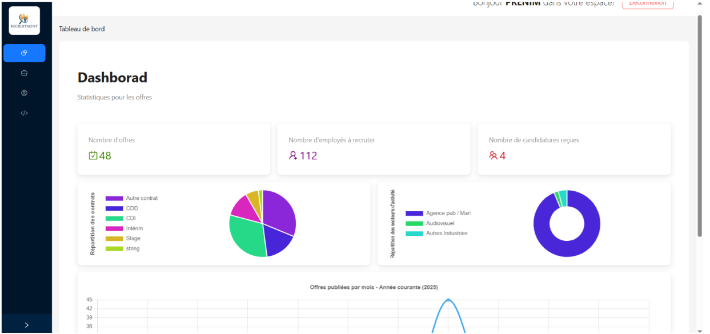

# 🚀 Gestionnaire d'Offres de Travail

Une application moderne de gestion des offres d'emploi avec interface utilisateur et dashboard administrateur, développée avec React et Vite.

## 🎯 Aperçu

Cette application permet la gestion complète des offres de travail avec deux interfaces distinctes :
- **Interface Utilisateur** : Pour consulter et postuler aux offres
- **Dashboard Administrateur** : Pour gérer les offres, candidatures et utilisateurs

## ✨ Fonctionnalités

### Interface Utilisateur
- 🔍 Recherche et filtrage des offres d'emploi
- 📄 Consultation détaillée des offres
- 📝 Candidature en ligne
- 👤 Profil utilisateur personnalisable
- 📱 Interface responsive et moderne
  

### Dashboard Administrateur
- 📊 Vue d'ensemble avec statistiques
- ➕ Création et modification d'offres
- 👥 Gestion des candidatures
- 🔧 Administration des utilisateurs
- 📈 Rapports et analyses
- 🎛️ Paramètres système
  

## 🛠️ Technologies utilisées

- **Frontend** : React 18+
- **Build Tool** : Vite
- **Styling** : CSS Modules
- **Routing** : React Router DOM
- **UI Components** : Ant Design
- **HTTP Client** : Axios
- **Form Handling** : React Hook Form
- **Icons** : Hero Icons

## 📋 Prérequis

Avant de commencer, assurez-vous d'avoir installé :

- **Node.js** (version 16.0 ou supérieure)
- **npm** (version 7.0 ou supérieure) ou **yarn**
- **Git**

## 🚀 Installation

1. **Clonez le repository**
   ```bash
   git clone https://github.com/noureddineFatimi/job-management-ui.git
   cd job-management-ui
   ```

2. **Installez les dépendances**
   ```bash
   npm install
   # ou
   yarn install
   ```

3. **Configurez les variables d'environnement**
   ```bash
   cp .env.example .env
   ```
   Modifiez le fichier `.env` avec vos paramètres :
   ```env
   VITE_API_URL=http://localhost:3001/api
   VITE_APP_NAME=Job Manager
   VITE_APP_VERSION=1.0.0
   ```

4. **Démarrez le serveur de développement**
   ```bash
   npm run dev
   # ou
   yarn dev
   ```

L'application sera accessible sur `http://localhost:5173`

## 📜 Scripts disponibles

```bash
# Démarrage en mode développement
npm run dev

# Build de production
npm run build

# Prévisualisation du build
npm run preview

# Linting du code
npm run lint

# Correction automatique des erreurs de linting
npm run lint:fix

# Tests unitaires
npm run test

# Tests avec couverture
npm run test:coverage

# Formatage du code avec Prettier
npm run format
```

## 💡 Utilisation

### Interface Utilisateur

1. **Inscription/Connexion** : Créez un compte ou connectez-vous
2. **Recherche d'offres** : Utilisez les filtres pour trouver des emplois
3. **Candidature** : Postulez directement depuis l'application
4. **Suivi** : Consultez le statut de vos candidatures

### Dashboard Administrateur

1. **Accès admin** : Connectez-vous avec un compte administrateur
2. **Gestion des offres** : Créez, modifiez ou supprimez des offres
3. **Suivi des candidatures** : Gérez les candidatures reçues

## 🌐 Déploiement

### Build de production

```bash
npm run build
```

### Déploiement sur Vercel

```bash
npm install -g vercel
vercel --prod
```

### Déploiement sur Netlify

```bash
npm run build
# Puis glissez-déposez le dossier dist/ sur netlify.com
```

### Déploiement avec Docker

```dockerfile
FROM node:18-alpine

WORKDIR /app
COPY package*.json ./
RUN npm ci --only=production

COPY . .
RUN npm run build

EXPOSE 5173
CMD ["npm", "run", "preview"]
```

## 🤝 Contribution

Les contributions sont les bienvenues ! Voici comment procéder :

1. **Forkez le projet**
2. **Créez une branche** (`git checkout -b feature/nouvelle-fonctionnalite`)
3. **Committez vos changements** (`git commit -m 'Ajout nouvelle fonctionnalité'`)
4. **Poussez vers la branche** (`git push origin feature/nouvelle-fonctionnalite`)
5. **Ouvrez une Pull Request**

### Standards de code

- Utilisez ESLint et Prettier
- Suivez les conventions de nommage
- Écrivez des tests pour les nouvelles fonctionnalités
- Documentez les changements importants
